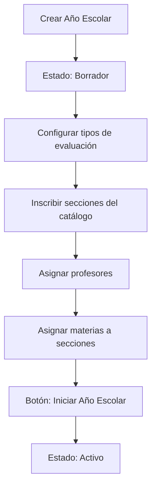
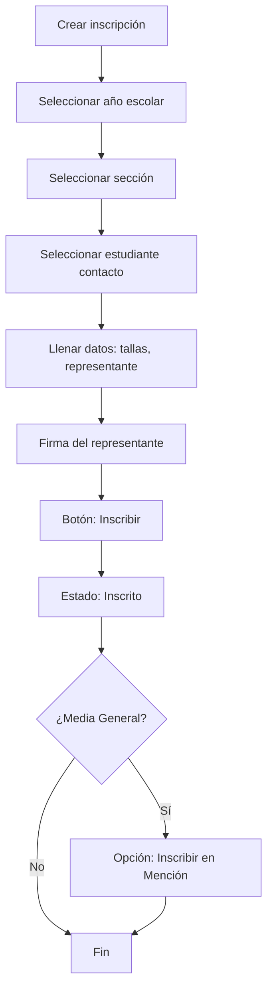
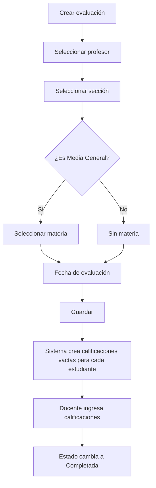
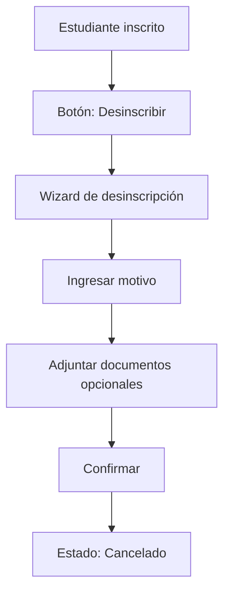
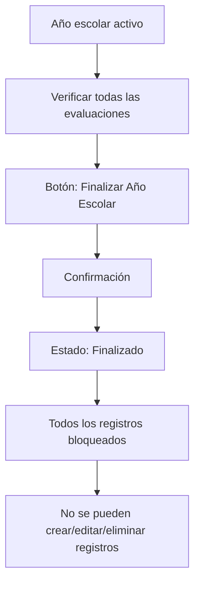
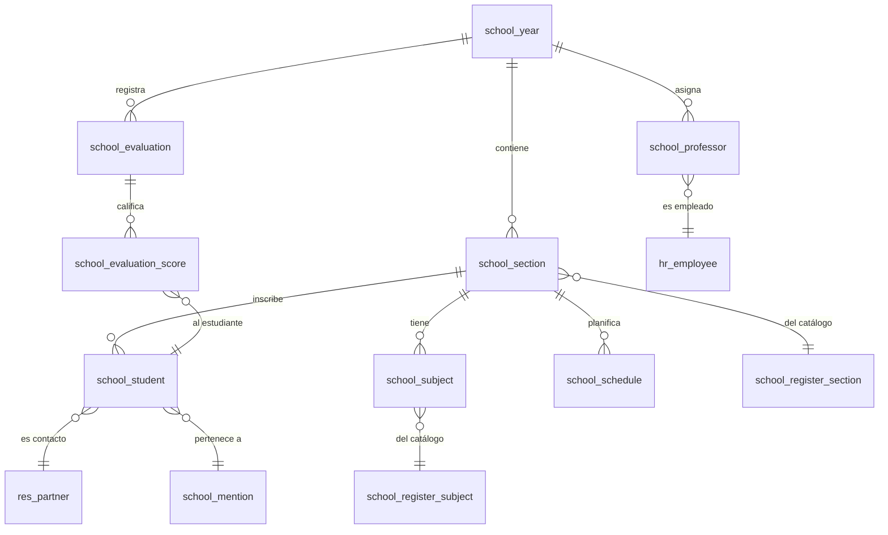

# PMA Public School Venezuela - Odoo 19 Module

## Descripción General

**Sistema Educativo Público** es un módulo completo de gestión escolar para Odoo 19, diseñado específicamente para instituciones educativas públicas en Venezuela. Permite administrar estudiantes, docentes, secciones, evaluaciones, asistencias, horarios y más.

- **Versión**: 19.0.0.6
- **Autor**: Pozzomire'z Agency
- **Licencia**: OPL-1
- **Categoría**: Education
- **Dependencias**: `base`, `contacts`, `hr`

---

## 📂 Estructura del Módulo

```
pma_public_school_ve/
├── __manifest__.py          # Configuración del módulo
├── __init__.py              # Inicializador de Python
├── models/                  # 17 modelos de negocio
│   ├── hr_employee.py
│   ├── res_partner.py
│   ├── school_attendance.py
│   ├── school_education_level.py
│   ├── school_evaluation.py
│   ├── school_evaluation_score.py
│   ├── school_evaluation_type.py
│   ├── school_mention.py
│   ├── school_modality.py
│   ├── school_professor.py
│   ├── school_register_section.py
│   ├── school_register_subject.py
│   ├── school_schedule.py
│   ├── school_section.py
│   ├── school_section_letter.py
│   ├── school_student.py
│   ├── school_subject.py
│   ├── school_time_slot.py
│   └── school_year.py
├── views/                   # 15 archivos de vistas XML
├── wizards/                 # 2 asistentes transaccionales
├── data/                    # Datos de configuración inicial
├── demo/                    # Datos de demostración
├── security/                # Reglas de acceso
└── static/src/              # Assets JS/CSS para widgets
```

---

## 🗃️ Modelos de Datos

### 1. `school.year` - Año Escolar (Principal)
**Archivo**: `models/school_year.py` (1097 líneas)

El modelo central que orquesta todo el sistema. Cada año escolar es contenedor de secciones, estudiantes, profesores y evaluaciones.

#### Campos Principales:
| Campo | Tipo | Descripción |
|-------|------|-------------|
| `name` | Char | Nombre del año (ej: "2024-2025") |
| `current` | Boolean | Si es el año escolar activo |
| `state` | Selection | Estado: borrador, en_progreso, finalizado |
| `evalution_type_secundary` | Many2one | Tipo de evaluación para Media General |
| `evalution_type_primary` | Many2one | Tipo de evaluación para Primaria |
| `evalution_type_pree` | Many2one | Tipo de evaluación para Preescolar |
| `section_ids` | One2many | Secciones inscritas |
| `professor_ids` | One2many | Docentes asignados |
| `students_preescolar_ids` | Many2many | Estudiantes de preescolar |
| `students_primaria_ids` | Many2many | Estudiantes de primaria |
| `students_media_ids` | Many2many | Estudiantes de media general |

#### Campos Computados (Dashboard JSON):
- `students_count`, `sections_count`, `professors_count`, `evaluations_count`
- `approved_count`, `failed_count`
- `performance_by_level_json` - Rendimiento promedio por nivel
- `students_distribution_json` - Distribución por nivel (gráfico torta)
- `approval_rate_json` - Tasa de aprobación
- `top_students_year_json` - Top 10 mejores estudiantes
- `professor_summary_json` - Resumen de docentes
- `recent_evaluations_json` - Últimas 20 evaluaciones

#### Métodos Principales:
```python
action_start_year()      # Inicia el año escolar
action_finish_year()     # Finaliza y bloquea el año
_compute_dashboard_counts()
_compute_level_dashboard_json()
_build_performance_by_subject()
```

---

### 2. `school.student` - Inscripción de Estudiante
**Archivo**: `models/school_student.py` (563 líneas)

Representa la matrícula de un estudiante en un año escolar específico.

#### Campos Principales:
| Campo | Tipo | Descripción |
|-------|------|-------------|
| `name` | Char (computed) | Nombre completo del estudiante |
| `student_id` | Many2one → res.partner | Contacto del estudiante |
| `year_id` | Many2one → school.year | Año escolar |
| `section_id` | Many2one → school.section | Sección asignada |
| `parent_id` | Many2one → res.partner | Representante principal |
| `state` | Selection | borrador, inscrito (done), cancelado |
| `inscription_date` | Date | Fecha de inscripción |

#### Datos Físicos:
- `height` (Float) - Estatura en metros
- `weight` (Float) - Peso en kilogramos
- `size_shirt` (Selection) - Talla de camisa (xs, s, m, l, xl)
- `size_pants` (Integer) - Talla de pantalón
- `size_shoes` (Integer) - Talla de zapatos

#### Sistema de Menciones (Técnico Medio):
- `mention_id` (Many2one) - Mención técnica asignada
- `mention_state` (Selection) - not_enrolled, enrolled, graduated
- `mention_inscription_date` (Date)
- `mention_parent_signature` (Binary)

#### Campos de Desinscripción:
- `uninscription_date`, `uninscription_reason`
- `uninscription_document_1/2/3` (Binary)

#### Campos JSON Computados:
- `evaluation_scores_json` - Promedios por materia
- `general_performance_json` - Rendimiento general con estado (aprobado/reprobado)

#### Métodos Principales:
```python
validate_inscription()
action_open_uninscription_wizard()
action_open_mention_inscription_wizard()
action_withdraw_from_mention()
```

---

### 3. `school.section` - Sección Inscrita
**Archivo**: `models/school_section.py` (317 líneas)

Representa una sección activa en un año escolar.

#### Campos:
| Campo | Tipo | Descripción |
|-------|------|-------------|
| `name` | Char (computed) | Ej: "1er Año A" |
| `section_id` | Many2one → school.register.section | Sección base |
| `year_id` | Many2one → school.year | Año escolar |
| `type` | Selection | secundary, primary, pre |
| `student_ids` | One2many | Estudiantes inscritos |
| `subject_ids` | One2many | Materias asignadas |
| `professor_ids` | Many2many | Docentes asignados |
| `schedule_ids` | One2many | Horarios de clase |

#### Campos Computados:
- `subjects_average_json` - Promedios por materia
- `students_average_json` - Promedios por estudiante
- `top_students_json` - Top 5 mejores estudiantes

---

### 4. `school.evaluation` - Evaluación
**Archivo**: `models/school_evaluation.py` (212 líneas)

Representa una evaluación académica.

#### Campos:
| Campo | Tipo | Descripción |
|-------|------|-------------|
| `name` | Char | Nombre de la evaluación |
| `description` | Html | Descripción detallada |
| `evaluation_date` | Date | Fecha de la evaluación |
| `year_id` | Many2one | Año escolar |
| `section_id` | Many2one | Sección evaluada |
| `subject_id` | Many2one | Materia (solo Media General) |
| `professor_id` | Many2one | Docente que evalúa |
| `evaluation_score_ids` | One2many | Calificaciones individuales |

#### Visibilidad de Campos:
- `invisible_score` - Oculta puntaje numérico
- `invisible_literal` - Oculta calificación literal
- `invisible_observation` - Oculta observaciones

#### Estados:
- `state`: draft (borrador), in_progress (en progreso), done (completada)
- `state_score`: approve, failed

---

### 5. `school.evaluation.score` - Calificación Individual
**Archivo**: `models/school_evaluation_score.py` (145 líneas)

Calificación de un estudiante en una evaluación.

#### Campos:
| Campo | Tipo | Descripción |
|-------|------|-------------|
| `evaluation_id` | Many2one | Evaluación padre |
| `student_id` | Many2one | Estudiante calificado |
| `score` | Float | Puntaje numérico |
| `literal_type` | Selection | A, B, C, D, E (para Primaria) |
| `observation` | Html | Observación (para Preescolar) |
| `points_20` | Float (computed) | Puntaje en base 20 |
| `points_100` | Float (computed) | Puntaje en base 100 |

#### Calificaciones Literales:
```
A - Superó las expectativas
B - Cumplió con las expectativas
C - Cumplió casi con todas las expectativas
D - Cumplió con algunas expectativas
E - No cumplió con las expectativas
```

---

### 6. `school.professor` - Profesor Inscrito
**Archivo**: `models/school_professor.py` (77 líneas)

Asignación de un docente a un año escolar.

#### Campos:
| Campo | Tipo | Descripción |
|-------|------|-------------|
| `professor_id` | Many2one → hr.employee | Empleado docente |
| `year_id` | Many2one | Año escolar |
| `subject_ids` | Many2many | Materias asignadas |
| `section_ids` | Many2many | Secciones (Preescolar/Primaria) |

---

### 7. `school.subject` - Materia Asignada a Sección
**Archivo**: `models/school_subject.py` (67 líneas)

Asignación de una materia del catálogo a una sección específica.

#### Campos:
| Campo | Tipo | Descripción |
|-------|------|-------------|
| `section_id` | Many2one | Sección destino |
| `subject_id` | Many2one → school.register.subject | Materia del catálogo |
| `professor_id` | Many2one → school.professor | Docente asignado |

---

### 8. `school.attendance` - Asistencia
**Archivo**: `models/school_attendance.py` (472 líneas)

Registro de asistencia para estudiantes, empleados y visitantes.

#### Tipos de Asistencia:
- `student` - Asistencia de estudiante
- `employee` - Asistencia de empleado
- `visitor` - Registro de visitante

#### Campos Estudiante:
- `student_id`, `section_id`, `schedule_id`

#### Campos Empleado:
- `employee_id`

#### Campos Visitante:
- `visitor_name`, `visitor_id_number`, `visitor_destination`

#### Estados:
- `present` - Presente
- `absent` - Ausente
- `late` - Llegó tarde
- `excused` - Justificado

#### Métodos:
```python
get_attendance_statistics(date_from, date_to, section_id)
create_student_attendance_for_schedule(schedule_id, date, students_data)
create_employee_daily_attendance_bulk(date, employees_data)
register_visitor(visitor_data)
```

---

### 9. `school.schedule` - Horario de Clase
**Archivo**: `models/school_schedule.py` (468 líneas)

Horario semanal de clases.

#### Campos:
| Campo | Tipo | Descripción |
|-------|------|-------------|
| `section_id` | Many2one | Sección |
| `day_of_week` | Selection | 0-6 (lunes a domingo) |
| `start_time` | Float | Hora inicio (ej: 8.5 = 8:30) |
| `end_time` | Float | Hora fin |
| `subject_id` | Many2one | Materia (Media General) |
| `professor_id` | Many2one | Docente específico |
| `time_slot_id` | Many2one | Bloque horario predefinido |

#### Validaciones:
- No solapamiento de horarios por sección
- No solapamiento de horarios por profesor (cruzado)
- Campos requeridos según nivel educativo

#### Métodos:
```python
get_weekly_schedule_enhanced(section_id)
validate_professor_availability(professor_id, day, start, end)
create_from_template(section_id, template_data)
```

---

### 10. `school.time.slot` - Bloque Horario
**Archivo**: `models/school_time_slot.py` (188 líneas)

Bloques horarios predefinidos por nivel educativo.

#### Campos:
| Campo | Tipo | Descripción |
|-------|------|-------------|
| `name` | Char | Nombre (ej: "1er Bloque") |
| `education_level` | Selection | pre, primary, secundary |
| `start_time` | Float | Hora inicio |
| `end_time` | Float | Hora fin |
| `is_break` | Boolean | Si es recreo/descanso |
| `duration` | Float (computed) | Duración en horas |
| `time_range` | Char (computed) | "08:00 - 09:30" |

---

### 11. `school.mention` - Mención Técnica
**Archivo**: `models/school_mention.py` (76 líneas)

Especialización técnica para Media General Técnica.

#### Campos:
| Campo | Tipo | Descripción |
|-------|------|-------------|
| `name` | Char | Nombre (ej: "Informática") |
| `code` | Char | Código identificador |
| `description` | Text | Descripción |
| `subject_ids` | Many2many | Materias de la mención |
| `student_ids` | One2many | Estudiantes inscritos |
| `student_count` | Integer (computed) | Total estudiantes |

---

### 12. `school.evaluation.type` - Tipo de Evaluación
**Archivo**: `models/school_evaluation_type.py` (79 líneas)

Configuración del sistema de calificación por nivel.

#### Tipos Disponibles:
| type_evaluation | Descripción | Nota Mínima |
|-----------------|-------------|-------------|
| `20` | En base a 20 puntos | 10 |
| `100` | En base a 100 puntos | 50 |
| `literal` | Calificación literal (A-E) | C |
| `observation` | Solo observaciones | N/A |

---

### 13. `res.partner` (Heredado) - Contactos
**Archivo**: `models/res_partner.py` (349 líneas)

Extensión del modelo de contactos para estudiantes y representantes.

#### Campos Agregados:
| Campo | Tipo | Descripción |
|-------|------|-------------|
| `is_enrollment` | Boolean | Si es matrícula escolar |
| `is_twin` | Boolean | Si es gemelo |
| `born_date` | Date | Fecha de nacimiento |
| `age` | Integer (computed) | Edad en años |
| `size_json` | Json | Medidas físicas |
| `inscriptions_count` | Integer | Total de inscripciones |
| `current_section_id` | Many2one | Sección actual |
| `current_year_id` | Many2one | Año escolar actual |
| `historical_performance_json` | Json | Historial de rendimiento |
| `current_performance_json` | Json | Rendimiento actual |

---

### 14. `hr.employee` (Heredado) - Empleados
**Archivo**: `models/hr_employee.py` (146 líneas)

Extensión para personal escolar con campos específicos de Venezuela.

#### Campos de Empleado Escolar:
| Campo | Tipo | Descripción |
|-------|------|-------------|
| `school_employee_type` | Selection | administrativo, docente, obrero, cenar |
| `subject_ids` | Many2many | Materias que puede impartir |
| `cod_estado` | Char (computed) | Código de estado |
| `municipio` | Char | Municipio |
| `parroquia` | Char | Parroquia |
| `codigo_plantel` | Char | Código del plantel |
| `turno_manana` | Boolean | Trabaja turno mañana |
| `turno_tarde` | Boolean | Trabaja turno tarde |
| `nivel_educativo_ids` | Many2many | Niveles que atiende |
| `horas_academicas` | Float | Horas académicas |
| `situacion_trabajador` | Selection | activo, reposo, jubilado, etc. |

---

### 15. `school.register.section` - Catálogo de Secciones
**Archivo**: `models/school_register_section.py` (50 líneas)

Secciones base que pueden inscribirse en años escolares.

#### Campos:
| Campo | Tipo | Descripción |
|-------|------|-------------|
| `name` | Char | Nombre (ej: "1er Año") |
| `type` | Selection | secundary, primary, pre |
| `letter_id` | Many2one | Letra (A, B, C) |
| `subject_ids` | Many2many | Materias aplicables |

---

### 16. `school.register.subject` - Catálogo de Materias
**Archivo**: `models/school_register_subject.py` (58 líneas)

Materias disponibles en el sistema.

#### Campos:
| Campo | Tipo | Descripción |
|-------|------|-------------|
| `name` | Char | Nombre de la materia |
| `section_ids` | Many2many | Secciones donde aplica |
| `professor_ids` | Many2many | Docentes capacitados |
| `mention_ids` | Many2many | Menciones relacionadas |

---

### 17. `school.section.letter` - Letras de Sección
**Archivo**: `models/school_section_letter.py` (28 líneas)

Letras disponibles para identificar secciones (A, B, C, etc.).

---

## 🖥️ Vistas y Pantallas

### Estructura de Menú Principal

```
📁 Escuela
├── 📊 Tablero (Dashboard del año actual)
├── 📚 Gestión Académica
│   ├── 📋 Operaciones Diarias
│   │   ├── Secciones Activas
│   │   ├── Estudiantes del Año
│   │   ├── Docentes Asignados
│   │   └── Evaluaciones en Curso
│   └── 📜 Registros Históricos
│       ├── Años Escolares Pasados
│       ├── Historial de Secciones
│       ├── Historial de Estudiantes
│       ├── Historial de Docentes
│       └── Historial de Evaluaciones
├── ✅ Asistencias
│   ├── Registro Rápido
│   ├── Estudiantes
│   ├── Personal
│   └── Todos los Registros
├── 📅 Planificación
│   ├── Vista de Calendario
│   ├── Horarios de Clase
│   └── Bloques Horarios
└── 👥 Directorio
    ├── Estudiantes (Contactos)
    ├── Personal
    │   ├── Empleados
    │   └── Departamentos
    └── ⚙️ Configuración
        ├── Grados/Secciones Base
        ├── Letras de Sección
        ├── Catálogo de Materias
        └── Menciones Técnicas
```

---

## 📋 Detalle de Cada Pantalla

### 1. Dashboard - Año Escolar (`school.year`)
**Archivo Vista**: `views/school_year_view.xml`

#### Tipos de Vista:
- ✅ **Kanban**: Lista de años escolares como tarjetas
- ✅ **Form**: Dashboard completo con tabs por nivel

#### Acciones CRUD:
| Acción | Disponible | Restricciones |
|--------|------------|---------------|
| Crear | ✅ Sí | Solo en estado `draft` |
| Leer | ✅ Sí | Siempre disponible |
| Editar | ✅ Parcial | Solo nombre y tipo evaluación cuando `state != finished` |
| Eliminar | ❌ No | Protegido si tiene secciones/estudiantes/evaluaciones |

#### Botones de Acción:
| Botón | Método | Visible Cuando | Efecto |
|-------|--------|----------------|--------|
| **Iniciar Año Escolar** | `action_start_year()` | `state = draft` | Cambia estado a `active`, marca como año actual |
| **Finalizar Año Escolar** | `action_finish_year()` | `state = active` | Bloquea todos los registros, estado a `finished` |

#### Tabs del Formulario:
1. **Dashboard General**: KPIs, gráficos de distribución, tasa aprobación, top 10 estudiantes
2. **Media General**: Configuración evaluación, secciones, rendimiento, top 3 por sección
3. **Técnico Medio**: Estudiantes con mención, rendimiento
4. **Primaria**: Secciones, rendimiento, top estudiantes
5. **Preescolar**: Secciones, rendimiento
6. **Estudiantes**: Lista completa de inscripciones
7. **Profesores**: Resumen docentes, estadísticas por tipo, materias difíciles
8. **Evaluaciones**: Estadísticas, evaluaciones recientes

#### Widgets Personalizados (JavaScript):
- `year_performance_overview` - Gráfico de rendimiento por nivel
- `students_distribution_chart` - Gráfico torta distribución
- `approval_rate_gauge` - Gauge de tasa aprobación
- `sections_comparison_chart` - Comparativa secciones
- `top_students_list` - Lista top estudiantes
- `professor_summary_widget` - Resumen profesores
- `general_performance_graph` - Gráfico rendimiento
- `level_dashboard` - Dashboard por nivel

---

### 2. Inscripción de Estudiantes (`school.student`)
**Archivo Vista**: `views/school_student_view.xml`

#### Tipos de Vista:
- ✅ **Kanban**: Tarjetas con nombre, año, sección, estado
- ✅ **List/Tree**: Tabla con columnas principales (create="0")
- ✅ **Form**: Formulario completo de inscripción

#### Acciones CRUD:
| Acción | Disponible | Restricciones |
|--------|------------|---------------|
| Crear | ✅ Sí | Desde año escolar activo |
| Leer | ✅ Sí | Siempre |
| Editar | ✅ Parcial | Solo en estado `draft`, campos readonly después |
| Eliminar | ❌ No | Protegido si tiene calificaciones |

#### Botones de Acción:
| Botón | Método | Visible Cuando | Efecto |
|-------|--------|----------------|--------|
| **Inscribir** | `validate_inscription()` | `state = draft` | Confirma inscripción, estado a `done` |
| **Desinscribir** | `action_open_uninscription_wizard()` | `state = done` | Abre wizard de desinscripción |
| **Inscribir en Mención** | `action_open_mention_inscription_wizard()` | Media General + tiene mención + no inscrito | Abre wizard de mención |
| **Retirar de Mención** | `action_withdraw_from_mention()` | `mention_state = enrolled` | Retira de mención técnica |

#### Tabs del Formulario:
1. **Información de inscripción**: Escuela anterior, observaciones, representante, firma
2. **Rendimiento académico**: Gráficos de notas y resumen (solo Media General)
3. **Tallas**: Estatura, peso, tallas de ropa y zapatos
4. **Información de Desinscripción** (visible si `state = cancel`): Motivo, documentos
5. **Información de Mención** (visible si Media General con mención): Fecha, firma

#### Campos Condicionales:
- `section_id`: Readonly si no hay año seleccionado o estado ≠ draft
- `student_id`: Readonly si no hay sección o estado ≠ draft
- `mention_id`: Solo visible para `type = secundary`

---

### 3. Secciones (`school.section`)
**Archivo Vista**: `views/school_section_view.xml`

#### Tipos de Vista:
- ✅ **List/Tree**: Tabla con sección, profesores, materias, estudiantes
- ✅ **Form**: Formulario con tabs

#### Acciones CRUD:
| Acción | Disponible | Restricciones |
|--------|------------|---------------|
| Crear | ✅ Sí | Desde año escolar |
| Leer | ✅ Sí | Siempre |
| Editar | ✅ Parcial | Materias/profesores editables |
| Eliminar | ❌ No | Protegido si tiene estudiantes/evaluaciones |

#### Tabs del Formulario:
1. **Estudiantes**: Lista de estudiantes inscritos (readonly, create="0")
2. **Materias** (solo Media General): Lista de materias con profesor asignado
3. **Docentes** (Preescolar/Primaria): Profesores asignados (readonly)
4. **Rendimiento**: Promedios por materia, por estudiante, top 5

#### Listas Editables:
- Estudiantes: Solo lectura
- Materias: `editable="top"`, `create="1"` - Se pueden agregar materias
- Docentes: Solo lectura

---

### 4. Evaluaciones (`school.evaluation`)
**Archivo Vista**: `views/school_evaluation_view.xml`

#### Tipos de Vista:
- ✅ **List/Tree**: Tabla con todas las evaluaciones
- ✅ **Form**: Formulario de creación/edición de evaluación

#### Acciones CRUD:
| Acción | Disponible | Restricciones |
|--------|------------|---------------|
| Crear | ✅ Sí | Siempre (año activo) |
| Leer | ✅ Sí | Siempre |
| Editar | ✅ Sí | Nombre, descripción, fecha |
| Eliminar | ❌ No | Protegido si tiene calificaciones |

#### Campos del Formulario:
- `year_id`: Readonly (automático)
- `professor_id`: Seleccionar primero
- `section_id`: Dependiente de profesor
- `subject_id`: Solo visible si hay materias (Media General)
- `evaluation_date`: Requerido

#### Tabs:
1. **Descripción**: Campo HTML para descripción detallada
2. **Calificaciones**: Vista Kanban + Form de calificaciones individuales

#### Sub-vista de Calificaciones (`school.evaluation.score`):
- **Kanban**: Muestra estudiante, puntaje/literal, estado
- **Form**: Edición individual de cada calificación
- Campos visibles según tipo de evaluación:
  - `score` - Solo si `invisible_score = False` (Media General)
  - `literal_type` - Solo si `invisible_literal = False` (Primaria)
  - `observation` - Solo si `invisible_observation = False` (Preescolar)

---

### 5. Profesores (`school.professor`)
**Archivo Vista**: `views/school_professor_view.xml`

#### Acciones CRUD:
| Acción | Disponible | Restricciones |
|--------|------------|---------------|
| Crear | ✅ Sí | Desde año escolar |
| Leer | ✅ Sí | Siempre |
| Editar | ✅ Sí | Materias y secciones |
| Eliminar | ❌ No | Protegido si tiene materias/evaluaciones asignadas |

#### Campos:
- `professor_id`: Seleccionar empleado tipo "docente"
- `subject_ids`: Materias que puede impartir
- `section_ids`: Secciones asignadas (Preescolar/Primaria)

---

### 6. Asistencias (`school.attendance`)
**Archivo Vista**: `views/school_attendance_view.xml`

#### Tipos de Vista:
- ✅ **List/Tree**: Registros de asistencia
- ✅ **Form**: Formulario de registro
- ✅ **Search**: Filtros por tipo, estado, fecha

#### Filtros de Búsqueda:
- Por tipo (estudiante/empleado/visitante)
- Por estado (presente/ausente/tarde/justificado)
- Por fecha
- Por sección

#### Acciones:
- `Registro Rápido`: Acción para registro masivo
- Filtros predefinidos: Estudiantes, Personal, Todos

---

### 7. Horarios (`school.schedule`)
**Archivo Vista**: `views/school_schedule_view.xml`

#### Tipos de Vista:
- ✅ **List/Tree**: Lista de horarios
- ✅ **Form**: Formulario de creación
- Widget personalizado de calendario semanal

#### Campos:
- `section_id`: Sección
- `day_of_week`: Día de la semana (0-6)
- `start_time`, `end_time`: Horas en formato float
- `subject_id`: Materia (Media General)
- `professor_id`: Profesor
- `time_slot_id`: Bloque horario predefinido

---

### 8. Bloques Horarios (`school.time.slot`)
**Archivo Vista**: `views/school_time_slot_view.xml`

#### Acciones CRUD:
| Acción | Disponible | Restricciones |
|--------|------------|---------------|
| Crear | ✅ Sí | Definir nombre, nivel, horarios |
| Leer | ✅ Sí | Siempre |
| Editar | ✅ Sí | Todo editable |
| Eliminar | ✅ Sí | Si no hay horarios usando el bloque |

---

### 9. Catálogo de Secciones (`school.register.section`)
**Archivo Vista**: `views/school_register_section_view.xml`

Secciones maestras que se inscriben en años escolares.

#### Acciones CRUD Completas:
✅ Crear | ✅ Leer | ✅ Editar | ❌ Eliminar (protegido)

---

### 10. Catálogo de Materias (`school.register.subject`)
**Archivo Vista**: `views/school_register_subject_view.xml`

Materias disponibles en el sistema.

#### Acciones CRUD Completas:
✅ Crear | ✅ Leer | ✅ Editar | ❌ Eliminar (protegido si tiene relaciones)

---

### 11. Menciones Técnicas (`school.mention`)
**Archivo Vista**: `views/school_mention_view.xml`

Especialidades técnicas para Media General.

#### Acciones CRUD Completas:
✅ Crear | ✅ Leer | ✅ Editar | ❌ Eliminar (protegido si tiene estudiantes)

---

### 12. Contactos/Estudiantes (`res.partner`)
**Archivo Vista**: `views/school_register_partner_view.xml`

Vista extendida del modelo de contactos para gestión de estudiantes.

#### Campos Adicionales Visibles:
- Fecha de nacimiento, edad
- Medidas físicas
- Historial de inscripciones
- Rendimiento actual e histórico

---

### 13. Empleados/Personal (`hr.employee`)
**Archivo Vista**: `views/school_register_employee_view.xml`

Vista extendida para personal escolar con campos específicos de Venezuela.

#### Secciones:
- Ubicación geográfica (estado, municipio, parroquia)
- Códigos del plantel
- Turnos
- Niveles y modalidades
- Situación del trabajador

---

## 🔄 Flujos de Trabajo Principales

### Flujo 1: Inicio de Año Escolar



### Flujo 2: Inscripción de Estudiante



### Flujo 3: Creación de Evaluación



### Flujo 4: Desinscripción



### Flujo 5: Finalización de Año



---

## 🧙 Wizards (Asistentes)

### 1. Wizard de Desinscripción
**Modelo**: `school.uninscription.wizard`

Permite desinscribir un estudiante registrando:
- Motivo de desinscripción (requerido)
- Hasta 3 documentos de soporte

### 2. Wizard de Inscripción en Mención
**Modelo**: `school.mention.inscription.wizard`

Inscribe a un estudiante de Media General en una mención técnica:
- Selección de mención
- Representante autorizante
- Firma digital del representante
- Fecha de firma
- Observaciones


## 📊 Sistema de Evaluación

### Por Nivel Educativo:

| Nivel | Tipo de Calificación | Nota Aprobatoria |
|-------|---------------------|------------------|
| **Preescolar** | Observación | N/A (cualitativo) |
| **Primaria** | Literal (A-E) | C o superior |
| **Media General** | Numérica (base 20) | 10 o más |

### Flujo de Evaluación:
1. Crear evaluación (profesor, sección, fecha, materia)
2. El sistema crea automáticamente registros de calificación vacíos para cada estudiante
3. Docente ingresa calificaciones individuales
4. Sistema calcula promedios y estados (aprobado/reprobado)
5. Dashboard se actualiza con estadísticas

---

## 🔐 Seguridad

El archivo `security/ir.model.access.csv` define permisos de acceso para todos los modelos.

---

## 📦 Datos de Demostración

El módulo incluye datos demo extensivos:

| Archivo | Contenido |
|---------|-----------|
| `school_base_demo.xml` | Configuración base |
| `school_employees_demo.xml` | 10+ profesores originales |
| `school_students_demo.xml` | 25 estudiantes originales |
| `school_year_demo.xml` | Año 2024-2025 con secciones y materias |
| `school_enrollment_demo.xml` | Inscripciones originales |
| `school_evaluations_demo.xml` | Evaluaciones de muestra |
| `school_students_generated.xml` | 700 estudiantes generados |
| `school_employees_generated.xml` | 40 profesores generados |
| `school_enrollment_generated.xml` | 700 inscripciones |
| `school_evaluations_generated.xml` | 9,520 calificaciones |

### Generador de Datos:
El script `demo/generate_demo_data.py` genera datos masivos automáticamente.

---

## 🔗 Relaciones Entre Modelos



---

## 🛠️ API y Métodos Útiles

### Obtener año escolar actual:
```python
year = self.env['school.year'].search([('current', '=', True)], limit=1)
```

### Obtener estudiantes de una sección:
```python
students = section.student_ids.filtered(lambda s: s.state == 'done')
```

### Calcular promedio de un estudiante:
```python
# El campo general_performance_json contiene:
# - average: promedio general
# - state: 'approved' o 'failed'
# - subjects: lista de materias con promedios
performance = student.general_performance_json
```

### Obtener horario semanal:
```python
schedule_data = self.env['school.schedule'].get_weekly_schedule_enhanced(section_id)
```

### Registrar asistencia masiva:
```python
self.env['school.attendance'].create_student_attendance_for_schedule(
    schedule_id=schedule.id,
    date='2024-10-15',
    students_data=[
        {'student_id': 1, 'state': 'present'},
        {'student_id': 2, 'state': 'absent'},
    ]
)
```

---

## 📝 Notas Importantes

1. **Bloqueo de Registros**: Una vez finalizado un año escolar, todos sus registros quedan bloqueados.

2. **Protección de Eliminación**: Todos los modelos tienen métodos `unlink()` que previenen la eliminación de registros con dependencias.

3. **Campos JSON**: Muchos campos computados usan JSON para facilitar la integración con widgets JavaScript y APIs.

4. **Venezuela-Específico**: Los campos de empleados incluyen datos específicos del sistema educativo venezolano (códigos de plantel, RAC, etc.).

5. **Menciones**: Solo aplican a estudiantes de Media General (Técnico Medio).

---

## 🚀 Instalación

1. Copiar el módulo a la carpeta de addons de Odoo
2. Actualizar lista de aplicaciones
3. Buscar "Sistema Educativo Público"
4. Instalar (con o sin datos demo)

---

*Documentación generada para el módulo pma_public_school_ve v19.0.0.6*
